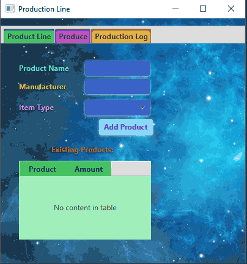
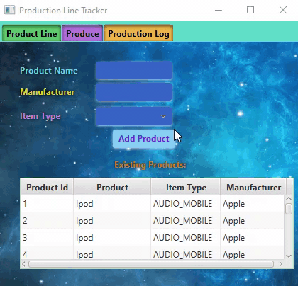

# ProductionLineOOP

This project is a GUI that allows you to add product names, types and manufactures to the database. This project allows me to demonstrate my knowledge on how to handle buttons, add combo boxes and have a choice box. I made the project (Jana Grunewald) with help from other students across both COP 3003 - Object-Oriented Programming classes. I started this project on 23 September 2019 and has been on going until 28 September 2019. I am at intermediate level with java and at an advanced level with CSS. I made this assignment for COP 3003 - Object-Oriented Programming. This assignment reflects me as a person by the way the 
colours are paired and how the items are displayed. I made it partially at school at Florida Gulf Coast University in COP 3003 - Object-Oriented Programming and finished most of it at home.

## Demonstration

## Documentation

JavaDoc is in the IDE. 

## Diagrams
Picture does not want to load. It's in the repository though. Under classcrap.png

## Getting Started

First you need to download IntelliJ (https://www.google.com/url?q=https%3A%2F%2Fwww.jetbrains.com%2Fidea%2Fdownload%2F&sa=D&sntz=1&usg=AFQjCNE_PgkWWh-ZuOBH6MD2d0a8HcXUWA ) or another IDE that will run JavaFX. You will need Java 11 JDK (https://www.google.com/url?q=https%3A%2F%2Fjdk.java.net%2Farchive%2F&sa=D&sntz=1&usg=AFQjCNGwG_cwrP8Dtz6zkHr2Wxjz1-HGCg ) and SDK (https://www.google.com/url?q=https%3A%2F%2Fgluonhq.com%2Fproducts%2Fjavafx%2F&sa=D&sntz=1&usg=AFQjCNG5akTTb_MlF5BmoCOmRJTChO_cLQ ) to run the project (additionally you can use Java 8 JDK and SDK but you will need to change the version under project structure when you open it). You will also need H2 downloaded (https://www.google.com/url?q=https%3A%2F%2Fwww.h2database.com%2Fhtml%2Fmain.html&sa=D&sntz=1&usg=AFQjCNE13ZojBzC3TFQrckdHkhQj-cPn-w ) and Scene Builder (https://www.google.com/url?q=https%3A%2F%2Fgluonhq.com%2Fproducts%2Fscene-builder%2F&sa=D&sntz=1&usg=AFQjCNFAj9kP87nkoEPWc9GSwux6cctk0w ). After you install IntelliJ, you can download the project and open the main file. You need to make sure you set up H2 to point to the resource folder. After you have everything set up, you should be able to run the project and see the different styles applied to the GUI.

## Built With

 - IntelliJ - This is a new IDE to me. I only know the basics.
 - Scene Builder - This is a new software to me. I only know the basics.
 - H2 database software - This is a new system to me. I only know the basics.
 - Java 8/ Java 11 JDK - Java 8 is better for JavaFX

## Contributing

If you know of a way to make the Tabs highlight when selected, feel free to add it.

## Author

Jana Grunewald

## License

License is in a text file in the repository.

## Acknowledgements

  - Stackoverflow
  - Shane, Odalys, Kevin, Nick, Kathryn, Owen
  - Damian, VanSelow
  
## History

The initial commit had just the GUI layout and the ReadMe. After The initial commit, the controller was updated with the button variables. I then made the handleActions for the buttons which are hardcoded to print to the console. I then populated the combobox in the initialize method after creating the local variable for the combobox. I then added fx:ids to all of the elements in FXML. I then added styles to the GUI using the fx:ids to make each item be a different colour.

## Key Programming Concepts Utilized

- Learn how to create a JavaFX project in IntelliJ
- Learn how to share the JavaFX project through IntelliJ to a private GitHub repository.
- Learn how to write an effective README document.
- Learn how to write FXML.
- Learn how to use SceneBuilder to create the outline for the GUI.
- Learn how to use CSS along with JavaFX to make the GUI your own.
- Learn how to make quality work.
- Learn how to style your projects correctly and professionally.
- Learn how to document your project professionally.
- Learn how to make labels, combo boxes, text fields, buttons, and choice boxes in FXML.
- Learn how to use H2 database software and connect the database to your GUI.
- Learn how to populate a combo box. 
